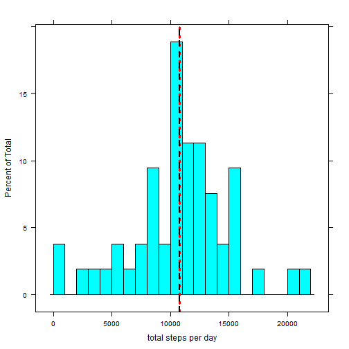
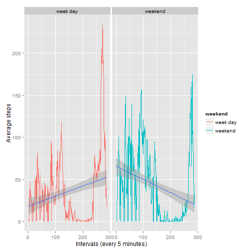

This is the report for assignment 1, for Reproducible Research.

### Loading and preprocessing the data
First, download and extract the dataset [Activity monitoring data](https://d396qusza40orc.cloudfront.net/repdata%2Fdata%2Factivity.zip), we got activity.csv. Then load the data and check the summary.


```r
## setwd("d:/R/RStudio/coursera/5.Reproducible_research")
unzip("./activity.zip")
rdata <- read.csv("activity.csv",header=TRUE,as.is=TRUE)
rdata$date <- as.Date(strptime(rdata$date, format="%Y-%m-%d"))
rdata$date.f <- as.factor(rdata$date)
head(rdata)
```

```
##   steps       date interval     date.f
## 1    NA 2012-10-01        0 2012-10-01
## 2    NA 2012-10-01        5 2012-10-01
## 3    NA 2012-10-01       10 2012-10-01
## 4    NA 2012-10-01       15 2012-10-01
## 5    NA 2012-10-01       20 2012-10-01
## 6    NA 2012-10-01       25 2012-10-01
```

### What is the mean total number of steps taken per day?


```r
x <- data.frame(levels(rdata$date.f),tapply(rdata$steps, rdata$date.f, sum))
colnames(x) <- c("date","total.steps")
rownames(x) <- c(1:dim(x)[1])
summary(x)
```

```
##          date     total.steps   
##  2012-10-01: 1   Min.   :   41  
##  2012-10-02: 1   1st Qu.: 8841  
##  2012-10-03: 1   Median :10765  
##  2012-10-04: 1   Mean   :10766  
##  2012-10-05: 1   3rd Qu.:13294  
##  2012-10-06: 1   Max.   :21194  
##  (Other)   :55   NA's   :8
```

```r
xx <- x[which(!is.na(x$total.steps)),]
xx$total.steps <- as.numeric(xx$total.steps)

stepsMean <- round(mean(xx$total.steps))
stepsMedian <- median(xx$total.steps)

library(lattice)
histogram(~total.steps, data=xx,
    xlab="total steps per day",
    breaks = 20,
    panel=function(x,...) {
        panel.histogram(x,...)
        panel.abline(v=stepsMean,col="red",lty=3,lwd=3)
        panel.abline(v=stepsMedian,col="black",lty=2,lwd=2)
    }
)
```

 

The mean of total numbers of steps (per day) is 1.0766 &times; 10<sup>4</sup>, median is 1.0765 &times; 10<sup>4</sup>.

### What is the average daily activity pattern?

```r
library(ggplot2)
rdata$interval.f <- as.factor(rdata$interval)
x <- rdata[which(!is.na(rdata$steps)),]
xx <- data.frame(levels(x$interval.f),tapply(x$steps, x$interval.f, mean))
colnames(xx) <- c("interval.f","average.steps")
xx$interval <- as.numeric(rownames(xx))

qplot(interval, average.steps, data=xx, geom=c("line","smooth"), method="lm")
```

 

```r
result <- as.character(xx[which(xx$average.steps==max(xx$average.steps)),][[1]])
```

In 5-minute interval, across all the days, on average, the interval with maximum number of steps is 835.

### Inputing missing values

By checking the summary, only "steps" has missing values, and there are 2304 NA's:

```r
summary(rdata[,1:3])
```

```
##      steps             date               interval     
##  Min.   :  0.00   Min.   :2012-10-01   Min.   :   0.0  
##  1st Qu.:  0.00   1st Qu.:2012-10-16   1st Qu.: 588.8  
##  Median :  0.00   Median :2012-10-31   Median :1177.5  
##  Mean   : 37.38   Mean   :2012-10-31   Mean   :1177.5  
##  3rd Qu.: 12.00   3rd Qu.:2012-11-15   3rd Qu.:1766.2  
##  Max.   :806.00   Max.   :2012-11-30   Max.   :2355.0  
##  NA's   :2304
```


```r
## xx is the variable contains average steps for each interval
x <- rdata
for (i in 1:length(rdata$steps)) {
    ## when steps is missing
    if(is.na(x[i,1])) {
        ## find the same row's internal value
        intervalValue <- x[i,3]
        ## get the average steps from xx based on the same internal value
        x[i,1] <- xx[which(xx$interval==intervalValue),][[2]]
    }
}
```
Now the new dataset looks like this: 

```r
summary(x[,1:3])
```

```
##      steps             date               interval     
##  Min.   :  0.00   Min.   :2012-10-01   Min.   :   0.0  
##  1st Qu.:  0.00   1st Qu.:2012-10-16   1st Qu.: 588.8  
##  Median :  0.00   Median :2012-10-31   Median :1177.5  
##  Mean   : 37.38   Mean   :2012-10-31   Mean   :1177.5  
##  3rd Qu.: 27.00   3rd Qu.:2012-11-15   3rd Qu.:1766.2  
##  Max.   :806.00   Max.   :2012-11-30   Max.   :2355.0
```


```r
stepsPerDay <- data.frame(levels(rdata$date.f),tapply(x$steps, x$date.f, sum))
colnames(stepsPerDay) <- c("date","total.steps")
stepsMean <- round(mean(stepsPerDay$total.steps))
stepsMedian <- median(stepsPerDay$total.steps)

library(lattice)
histogram(~total.steps, data=stepsPerDay,
    xlab="total steps per day",
    breaks = 20,
    panel=function(x,...) {
        panel.histogram(x,...)
        panel.abline(v=stepsMean,col="red",lty=3,lwd=3)
        panel.abline(v=stepsMedian,col="black",lty=2,lwd=2)
    }
)
```

 

After filling in the missing values, the mean of total numbers of steps (per day) is 1.0766 &times; 10<sup>4</sup>, median is 1.0766189 &times; 10<sup>4</sup>. 

Compared with first part of this report, the mean value was not changed, but the median was changed. It is a little obvious, since we filled in the missing values with average steps, so those values was originally not counted, but now devoted to the mean with a average value, so their devoting is nothing.

However, since those newly added values, we now got a large amount of points to elect the median, so the median value was different from first part.


### Are there differences in activity patterns between weekdays and weekends?


```r
x <- rdata[which(!is.na(rdata$steps)),]
library(chron)
x$weekend <- is.weekend(x$date)


##xx_weekend <- data.frame(levels(x$interval.f),tapply(x$steps, x$interval.f, mean))
colnames(xx) <- c("interval.f","average.steps")
xx$interval <- as.numeric(rownames(xx))

x_weekend <- x[which(x$weekend),]
x_weekday <- x[which(!x$weekend),]

xx_weekend <- data.frame(levels(x_weekend$interval.f),tapply(x_weekend$steps, x_weekend$interval.f, mean))
colnames(xx_weekend) <- c("interval","average.steps")
xx_weekend$weekend <- "weekend"
xx_weekday <- data.frame(levels(x_weekday$interval.f),tapply(x_weekday$steps, x_weekday$interval.f, mean))
colnames(xx_weekday) <- c("interval","average.steps")
xx_weekday$weekend <- "week day"
xx <-rbind(xx_weekday,xx_weekend)
xx$weekend <-as.factor(xx$weekend)
xx$interval <- as.numeric(xx$interval)

g <- ggplot(xx, aes(interval, average.steps))
g + geom_line(aes(color=weekend))  + geom_smooth(method="lm")  +facet_grid(.~weekend) + labs(x="Intervals (every 5 minutes)") + labs(y="Average steps")
```

 

Yes, on week day, people take more activity at end of day, while during weekend, people don't take that much activities.
